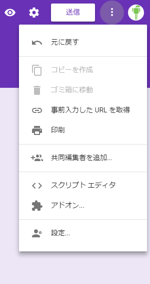
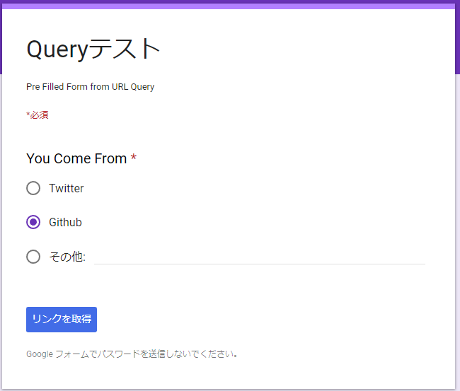

# Google Form Pre-Filled
Google Formの事前入力

## 例
 同じフォームをイベントごとに使いまわす
 
 [You Come From Github](https://docs.google.com/forms/d/e/1FAIpQLSdjIlKHkIijEiOQCeeOx1iIraojvDKadJ_V1Ue4i5eK_JGzpw/viewform?usp=pp_url&entry.574811788=Github)
 
 [You Come From Twitter](https://docs.google.com/forms/d/e/1FAIpQLSdjIlKHkIijEiOQCeeOx1iIraojvDKadJ_V1Ue4i5eK_JGzpw/viewform?usp=pp_url&entry.574811788=Twitter)
 
 利点:フォーム入力者が迷わないようにできる.
 
 
## How To Prefilled

1. Formを作成
2. **事前入力したURLを取得** を選択



3. 事前入力を行いURLを発行

  

 
 ## Shorten
 
 Link実際のリンクがどうなっているかというと 
 ```
 https://docs.google.com/forms/d/e/1FAIpQLSdjIlKHkIijEiOQCeeOx1iIraojvDKadJ_V1Ue4i5eK_JGzpw/viewform?usp=pp_url&entry.574811788=Github
 ```
 クエリが丸見えなのでgoo.glで短縮したいところだが
  > Starting March 30, 2018, we will be turning down support for goo.gl URL shortener. From April 13, 2018 only existing users will be able to create short links on the goo.gl console. You will be able to view your analytics data and download your short link information in csv format for up to one year, until March 30, 2019, when we will discontinue goo.gl. Previously created links will continue to redirect to their intended destination. Please see this blog post for more details.
  
  goo.glはそろそろ終了なので[Dynamic Link(Firebase)](https://firebase.google.com/support/guides/url-shortener?hl=ja)を使う.
  
#### Dynamic Linkを使用したリンク
  
 * [You Come From Github Short by Dynamic Link](https://ur15h7.page.link/4mGH)
 * [You Come From Twitter Short by Dynamic Link](https://ur15h7.page.link/4mTwi)
 
####  実際のリンク

 > https://ur15h7.page.link/4mGH
 
 > https://ur15h7.page.link/4mGH
 
 開発者側が設定できるのは `ur15h7(共通)`と `page.link/` 以下の部分
 
 `page.link/` 以下の部分は任意で設定できるがAndroid用とかiOS用とか面倒なので自動で生成してくれた方がこの場合はいいかな.
 
  